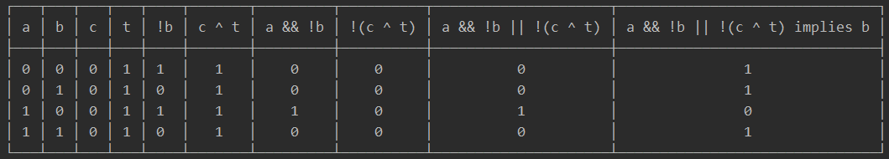

# DiscreteMath
Discrete Math abstract library

When worked on: September 2020 - May 2021

- - -

The entire class of discrete math I took as a library (and some more)

⭐ - Favorites / most impressive

* Combinatorics
* Expressions
  * Drawer (like desmos) ⭐
    * Declare variables and functions
    * Automatically adjusts precision
    * Real-time render scaling
    * Deep exception detection
  * Functions / Operators
  * Simplifier ⭐
    * Factoring
  * Derivatives ⭐
  * Equations/Inequalities
  * Knows Domain (using Sets)
* Graphs
  * Simple graphs
  * Drawer
* Gödel Numbers
  * From and to numbers
* Matrices
  * Convert to Graph
  * Utility
    * +, -, ×, ÷ matrices
* Parser (String input) ⭐
  * Read statements and expressions
  * Apply to any tree structure *(unfinished)*
  * Syntax error catching
* Proofs
  * Exhaustive (uses combinatorics)
* Random generator
  * Generate randomized expressions or statements
  * Custom seed and size
* Sets
  * In/finite
* Statements (tree structure)
  * Boolean logic
  * Existential/Universal
  * Laws (to simplify)
  * Logic table display ⭐
  * Simplifier
    * Deep search commutative operations

- - -
Examples:

```java
Statement statement = StatementParser.parseStatement("a    and  ~ b or  !(c ^   t) implies b");
```
`a && !b || !(c ^ t) implies b // (c is contradiction, t is tautology)`

*other display style:*

`((a ⋀ (¬b)) ⋁ (¬(c ⊻ t))) ⇒ b`
```java
statement.getTable()
```

- - -
```java
StatementGenerator.generate(3L, 14)
```
`A nand (B implies not A or A xor A xnor A)`
```java
.simplified()
```
`not A`
- - -
```java
Variable varA = new Variable("a");
Expression exp = varA.pow(LOG.of(varA, varA.pow(varA))).minus(Constant.ZERO);
```
```java
exp
```
`a ^ LOG(a, a ^ a) - 0`
```java
exp.simplified()
```

`a ^ a`
```java
exp.derive()
```
`a ^ LOG(a, a ^ a) * (LOG(a, a ^ a) / a * 1 + LN a((a ^ a * (a / a * 1 + LN a * 1) - a ^ a * LOG(a, a ^ a) * 1 / a) / a ^ a * LN a)) - 0`
```java
exp.derive().simplified()
```
`a ^ a * (LOG(a, a ^ a) / a + LN a(1 + LN a - LOG(a, a ^ a) / a) / LN a)`
```java
exp.derive().getUniversalStatement() // the domain
```
`∀a∈R a > 0 && a ^ a > 0 && a > 0 && a ^ a > 0 && a != 0 && t && a != 0 && a != 0 && a > 0 && a != 0 && t && a != 0 && a != 0 && a > 0 && t && a != 0 && a != 0 && a > 0 && a ^ a > 0 && t && a != 0 && a != 0 && a != 0 && a > 0 && a ^ a * LN a != 0`
```java
exp.derive().getUniversalStatement().simplified()
```
`∀a∈R a > 0 && a ^ a > 0 && a != 0 && a ^ a > 0 && a ^ a * LN a != 0`
- - -
```java
Definition.ODD.test(new Constant(5.0))
```
`for the integer 5, it is odd iff 5 % 2 == 1, which is true, so 5 is odd`
```java
new ExistentialStatement<>(
        a -> new UniversalStatement<>(b -> a[0].times(b[0]).equates(Constant.ZERO),
		  new FiniteSet<>(new NumberLiteral(9), new NumberLiteral(5)), true,
		  new Variable("b")),
        new FiniteSet<>(new NumberLiteral(0), new NumberLiteral(1), new NumberLiteral(2)), true,
	new Variable("a"))
```
`{∃a∈{2.0, 1.0, 0.0}|∀b∈{9.0, 5.0}, a * b = 0}`
```java
exhaustiveProofString()
```
```
for a = 2.0, ↴
	for b = 5.0, a * b = 0, which is false. (invalid), which is false... continuing
for a = 1.0, ↴
	for b = 5.0, a * b = 0, which is false. (invalid), which is false... continuing
for a = 0.0, ↴
	for b = 9.0, a * b = 0, which is true... continuing
	for b = 5.0, a * b = 0, which is true... continuing
	for b = 9.0, a * b = 0
	which are all true. (valid)
which is true. (valid)
```
- - -
```java
ZERO.equates(ZERO).godelNumber().getNumber()
```
`243000000`
```java
new GodelNumberFactors(243_000_000L).symbols()
```
`0=0`
```java
VariableStatement x = new VariableStatement('x');
forAll(x).in(new SpecialSet(SpecialSetType.Z), args -> x.nand(new VariableStatement('y'))).proven()
        .implies(Constant.of(3).plus(new Variable("abc")).equates(new Variable("var")))
```
```java
.godelNumber()
```
`¬(¬(A)∨¬(B))⊃(sss0+a)=b Gödel Number: 1181176374..........1505759230` ≈ 10^318
- - -


Very brief mid re-render frame while not very precise yet.


